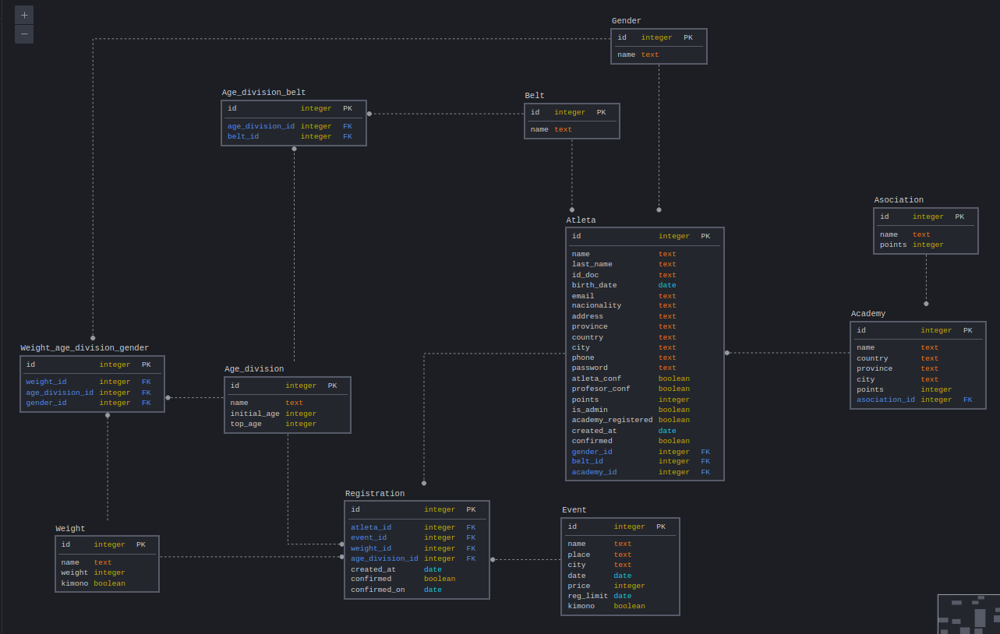

# Flask Website Starter Template

This repository is a web application created for the Ecuadorian Brazilian-Jiu-Jitsu circuit also in the context of the Foundations Software Engineering Course at the spring of 2021 at CODE University of Applied Science, based in Berlin, Germany but run remotely due to the pandemic. This repository was forked from the Flask Website Starter Template provided by the university, everything else is my original work. The focus here is on having a slim, working, full-stack website which can be (relatively) easily built, tested, and deployed on Google App Engine using GitHub actions. This README assume that the reader already has a basic familiarity with a broad range of topics and technologies, so it lacks explanation.

## Background

I started training Brazilian Jiu-Jitsu back in 2012 when I was 12 years old, BJJ just started developing in my country there were a few academies and it wasn't known all over the country. I got to see the development of this martial art really close since I grew up surrounded by people who practiced this sport and made a great relationship with my teachers. Now BJJ is in known all over the country, in the main cities of Ecuador there are many academies per neighborhood, making BJJ one of the most practiced sports/martial-arts in the country after football.

Now Ecuador despite being a small country is top 2 in BJJ in south america only after Brasil and I can dare to say is top 3 around the world after Brasil and the US. In 2019 Ecuadorian BJJ reached its peak when Johnny Tama won the black belt world championship, making him the first and only not brasilian south american to won this title.

Despite the exponencial growth Ecuadorian BJJ has, it hasn't adapted to the new technologies. Everything is still done by hand and paper when it comes to organizing tournaments, also academies still handle payments the old way and keep track of students training by hand. This is the part where I want to help with, every industry with growth is required to adapt to the new technologies to maintain the growth or even to accelerate it.

I spoke with my mentor wich at the same time is the organizer of the Ecuadorian Brazilian-Jiu-Jitsu circuit and also the president of the Ecuadorian Brasilian Jiu-Jitsu Federation to understand the main problems they have when dealing with tournaments and almost all of them could be solved by web technolgies, one of the main problems they had was organizing the brackets for each competition since in BJJ competitions the brackets are divided by belt, age division, gender and weight. Doing this by hand can be very tedious and cand lead to mistakes, it's a very complicated task they have to deal with every month. Also to create the ranking and to post the results is a very dificult task they have to deal with after every competition. This results in a poorly organized event with the schedule never working as it should and athletes fighting till 2am because of misorganisation. So this problems affect both athletes and organizers.

I also spoke with some of my friends that often compete to tell my about the problems, they said that having to choose between to many options every month was really tedious and lead to confusion. Also they said is preety annoying to have a unpuctual schedule that never works and having to fight at 1am is never great. They said they would like tournaments to be always on time so they know exactly at what time they should be there to compete and not having to arrive at the scheduled hour and then having to fight 2-3 hours later.

This website aims to solve this problems to both athletes and organizers by automating most of the task that has to be done by both of them, such as event registrations with opttions restricted by athletes gender and date of birth, separating the athletes by belt, age division, gender and weight and making a automated ranking by looking for the results provided by the organizers in a very simple way.

# ER model

# Installation Instructions

This will be a quick overview of how to run this project locally.

## Before you start...

You should have:

- Python 3.8.x installed on your computer
- Git 2.28+ installed on your computer
- Visual Studio Code (or another IDE of your choosing) installed on your computer

### Cloning this Repo

Clone this repository to your computer

- Choose (or create) a working directory on your own computer and change directory into it
- Clone this repository running git clone https://github.com/tuprogramadorfav/foundations-project-template.git in that working directory.

### Get Set Up for Local Development:

- Change directory to the recently cloned folder. This will be your root folder.
- In the terminal, create a new virtual environment (e.g. 'venv') for this project:
  > python3.8 -m venv venv
- Activate your virtual environment (Windows: source venv\Scripts\activate; Mac and Linux: source venv/bin/activate)
- Download the Python modules listed in requirements.txt using pip:

  > pip install -r requirements.txt

- Set local environment variables. Create a '.env' file on your root directory or in bash.profile file
  > MAIL_USERNAME = yourmail
  > MAIL_PASSWORD = yourmailpassword

### Run the Flask App:

- You are all set to run the app. Make sure the your virtual environment is active (instructions above) and you are anywhere inside the root folder.
- Run flask using:
  > flask run
- All done! You can access the flask app in your browser either on http://127.0.0.1:8000/ or http://localhost:8000.
